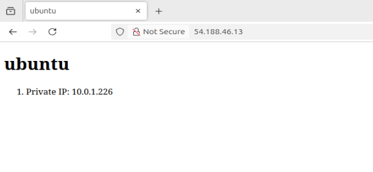

# Labweek11

### Deploy infrastructure with Terraform:
```
cd terraform
terraform init
terraform apply --auto-approve
```

### Run the Ansible Playbook:
```
cd ansible
ansible-playbook -i inventory/aws_ec2.yml playbook.yml
```

If that does not work, might need to install boto3:
```
sudo apt update
sudo apt install python3-boto3
```

### Screenshot:


### After Taking Screenshot:
```
cd terraform
terraform delete --auto-approve
```
